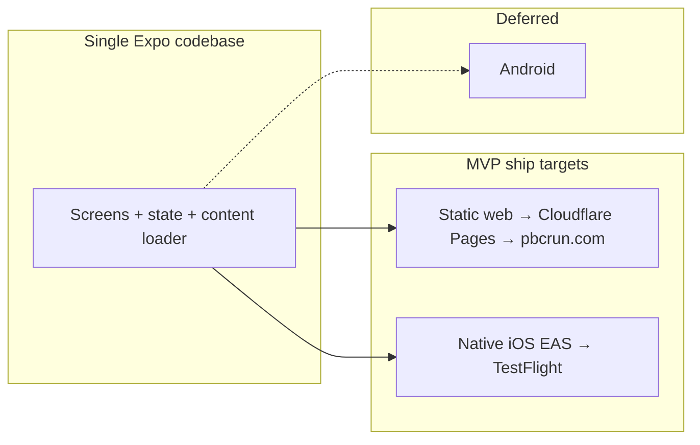
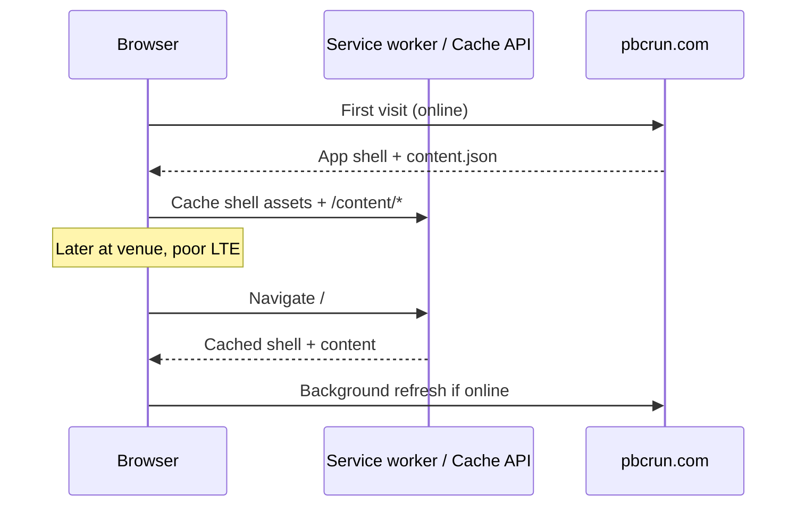
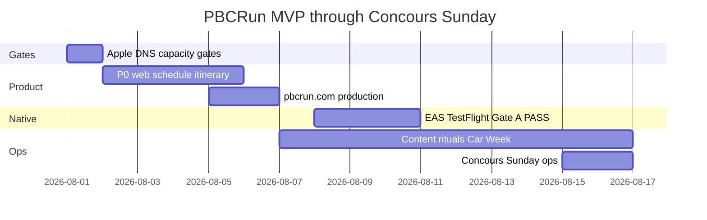

# PBCRun — MVP Product & Technical Design

| Field | Value |
|-------|--------|
| **Document** | PBCRun MVP Design Brief + Technical Design |
| **Product brand** | **PBCRun** (primary) |
| **Domain** | **https://pbcrun.com** (owned; production web required for MVP week) |
| **Public long-form / tagline** | **Unofficial Monterey Car Week companion** (founder-locked) |
| **Optional expansion** | **Not used as default title/tagline.** Do not ship “Pebble Beach, California Run” or “Pebble Beach Concours Run” as product name/tagline. |
| **Repo** | `/Users/domino/PBRun` · https://github.com/curlspo/PBRun (**keep repo name**; product UI = PBCRun) |
| **Author** | TBD (founder / engineering) — fill before soft launch |
| **Date** | 2026-08-01 |
| **Status** | **Approved for implementation (founder decisions 2026-08-01)** |
| **Deadline** | Public web (www and/or pages.dev first; apex when ready) by ~Aug 8–10; **TestFlight ~Aug 10–12** (Gate A PASS); hard useful-by **Aug 14–16** (ops through **Aug 16 evening**) |
| **Repo state (verified)** | Greenfield: `README.md`, `.gitignore` only; initial commit scaffold; no app code, no stack |

---

## Overview

**PBCRun** is an independent, unofficial companion for **Monterey Car Week** (roughly **August 7–16, 2026**), culminating in the **75th Pebble Beach Concours d'Elegance on Sunday, August 16, 2026**. Attendees juggle fragmented websites, PDFs, social posts, and paper programs while navigating crowded venues with poor cell service.

This document is a **product design brief** and **implementable technical design** for a **ruthlessly scoped ~2-week MVP**. Ship: **curated schedule, venues (list + directions; iOS map if time), personal itinerary, ticket deep-links, offline-tolerant content (platform-specific honesty below)**—not social, marketplace, ticketing, or official partnership.

### Locked product identity

| Layer | Value |
|-------|--------|
| **Primary brand** | **PBCRun** |
| **Domain** | **pbcrun.com** (soft launch: **www.pbcrun.com** and/or `*.pages.dev`; apex when DNS ready) |
| **Default public framing** | **“Unofficial Monterey Car Week companion”** (founder-locked) |
| **Avoid in product title / subtitle / logo** | “Pebble Beach, California Run”; “Pebble Beach Concours Run”; “Concours,” “Official,” “Partnered,” “Automotive Week” as product name; Concours logos; Lodge hero imagery |
| **Repo** | Keep **`PBRun` / curlspo/PBRun** |

### Recommended path

**One Expo (React Native) + TypeScript codebase** → **production web** (Cloudflare Pages → **www.pbcrun.com** / `*.pages.dev`, apex when ready) **and** **native iOS** via EAS → **TestFlight (Gate A PASS — dual launch path)**. Static JSON content, no accounts, local itinerary. **Android deferred.**

**Staffing:** **1 eng + 1 content** (founder-locked). Parallel tracks viable; TestFlight is **on the dual launch path**, not capacity-forced stretch. Serialized priority still applies if either track slips.



---

## Day-0 / Day-1 Hard Gates

These are **go/no-go**. Failures rewrite the launch definition immediately—do not burn calendar days on blocked paths.

### Gate results (founder decisions 2026-08-01)

| Gate | Result | Implication |
|------|--------|-------------|
| **A — Apple Developer** | **PASS** | Dual launch path: public web + **TestFlight target ~Aug 10–12**. Keep EAS on critical path for iOS. |
| **B — Domain / DNS** | **PARTIAL** | **www-only** (or incomplete apex). Soft launch on **`*.pages.dev` first**, then **https://www.pbcrun.com** when CNAME ready; **apex `pbcrun.com`** when ALIAS/A records available. Do not block product on apex. |
| **C — Staffing** | **1 eng + 1 content** | Parallel tracks viable. TestFlight is **not** forced-stretch solely due to capacity. |

### Gate A — Apple Developer Program (iOS path)

| Check | Pass criteria |
|-------|----------------|
| Membership | Active **paid** Apple Developer Program |
| Agreements | Latest agreements accepted in App Store Connect |
| App record | Can create app + register bundle ID **`com.pbcrun.app`** (or documented alternate if taken) |
| Signing | Can run EAS credentials / local cert flow |

| Result | Launch definition |
|--------|-------------------|
| **PASS (locked 2026-08-01)** | **Launched** = live public web (www and/or pages.dev; apex when ready) + **TestFlight** (target ~Aug 10–12) |
| **FAIL / unknown Day 1** | **Launched** = web only (required). iOS = **best-effort / stretch**. Reallocate Days 8–9 from EAS to web polish + content ops. |

**Status:** Gate A = **PASS**. Proceed with dual web + TestFlight plan. Enrollment lag is no longer the open blocker (still watch cert/profile first-time friction on Days 8–9).

### Gate B — Domain & host control

| Check | Pass criteria |
|-------|----------------|
| Registrar | Login works; can edit DNS for **pbcrun.com** zone |
| Host | Cloudflare account created; Pages project creatable |
| Deploy | Can publish a static page to `*.pages.dev` within hours |
| www | CNAME **www.pbcrun.com** → Pages (preferred soft-launch hostname while apex incomplete) |
| Apex | ALIAS/ANAME/A for **pbcrun.com** — **deferred until available** |
| Bundle ID | Register `com.pbcrun.app` same day (Gate A pass) |

| Result | Action |
|--------|--------|
| **PASS** | Full apex + www cutover |
| **PARTIAL (locked 2026-08-01)** | Day 1: **Cloudflare Pages `*.pages.dev` live**. Soft launch may use **pages.dev and/or www.pbcrun.com**. Apex **pbcrun.com** when ALIAS/A ready; optional later redirect apex ↔ www (pick one canonical). |
| **FAIL domain** | **Stop public brand push** until at least pages.dev or www controlled |

**Status:** Gate B = **PARTIAL**. Public soft-launch URL priority:

1. `https://<project>.pages.dev` (always available once Pages project exists)  
2. `https://www.pbcrun.com` (when www CNAME + TLS ready)  
3. `https://pbcrun.com` (apex when DNS complete)

### Gate C — Staffing capacity

| Mode | Minimum | Implication |
|------|---------|-------------|
| **Preferred (locked 2026-08-01)** | **1 eng + 1 content** (content may be part-time) | Parallel tracks A/B/C viable; TestFlight on dual launch path |
| **Solo** | 1 person owns eng + content + GTM | Serialized priority mandatory; TestFlight soft-launch becomes stretch even if Gate A passes |

---

## Capacity Model & Serialized Priority

### Roles (assign names Day 1)

| Role | Owns | Hours/day target (event week) |
|------|------|-------------------------------|
| **Eng** | Expo app, deploy, iOS build, bugs | Full-time |
| **Content** | Spreadsheet → JSON, verify times/URLs, A-tier checklist | 2–4h/day escalating to peak |
| **GTM / legal copy** | Disclaimer, store listing, soft-launch links | Light after PR 5 |

If solo: same person wears all three; use serialized stack.

### Serialized priority (solo or when behind)

Aligned with soft-launch ⛔ blockers: **web offline before TestFlight**. Gate A failure already makes iOS stretch—do not invert that order when solo.

| Order | Deliverable | Drop if late |
|-------|-------------|--------------|
| **1** | pbcrun.com schedule list UI + A-tier content + disclaimer + deploy | Never |
| **2** | Itinerary (local save) | Never after Day 4 target |
| **3** | Web app-shell offline cache (PR 8; airplane-mode acceptance) | Never before soft launch — **P0** |
| **4** | Venues list + Open in Maps (PR 6; pins not required) | Never before soft launch — **P0** |
| **5** | Content OTA refresh + ops through Aug 16 | High priority once #1 live |
| **6** | iOS TestFlight shell (same list UI) | **Stretch** if Gate A fail or Day 8+; never ahead of #3–4 |
| **7** | iOS map pins | **Cut by Day 5** if behind → list already covers day-of |
| **8** | iOS local notifications | **Cut by Day 5** if behind |

### Expanded cut line

```
Never drop: disclaimer, schedule list, event detail, itinerary, ticket deep-links,
            venues list + Maps links, production web at pbcrun.com,
            web offline cache after first load, A-tier content accuracy

By Day 5 if behind:
  Drop iOS map pins → venue list + system Maps links already ship (PR 6)
  Drop iOS local notifications → “up next” UI only

By Day 7 if behind:
  Drop all remaining P1; freeze feature set; content + reliability only
  iOS TestFlight = stretch if not already green

By Day 10 if behind:
  Polish only on web; no new features
Never block public pbcrun.com on map pins / notifs / TestFlight
```

---

## Branding & Naming

### Recommendation (locked post-review)

| Use case | Name | Notes |
|----------|------|--------|
| **Primary brand / wordmark** | **PBCRun** | Coined; matches domain |
| **Website `<title>` / header** | **PBCRun** — Unofficial Monterey Car Week companion | Default public long-form is the **tagline**, not a geographic expansion |
| **App Store display name** | **PBCRun** | No “Concours,” no leading “Pebble Beach” |
| **App Store subtitle** | Unofficial Car Week schedule | ≤30 chars; unofficial framing |
| **Body / About nominative use** | May name Monterey Car Week, public venues, and the **Pebble Beach Concours d'Elegance** as events you help plan around | Factual only |
| **Optional expansion** | *Pebble Beach, California Run* / *Pebble Beach Concours Run* | **Do not use as default title or tagline** (founder decision 2026-08-01). Keep out of logo lockup, App Store name/subtitle, and `<title>`. |
| **Deep link scheme** | `pbcrun://` optional for MVP | Universal Links **out of MVP** (no associated-domains ceremony) |
| **Bundle ID** | `com.pbcrun.app` | Verify Day 1; document alternate if taken |
| **GitHub** | Keep `PBRun` | README: product brand PBCRun · domain pbcrun.com |

### Do-not-use list (assets & marketing)

- Official Concours / Pebble Beach Company logos or wordmarks as product branding  
- Lodge / official program photography without license  
- “Automotive Week” as **product** name  
- “Official,” “endorsed,” “partnered,” “presented by”  
- “Pebble Beach Concours Run” as app or site title  
- Leading with “Pebble Beach” in store name or logo text  

### Tagline (pick one; default #1)

1. **Default:** “Unofficial Monterey Car Week companion”  
2. “Your run of show for Car Week”  
3. “Schedule · Map · My Plan — independent fan tool”

### Why this brand posture

Coined **PBCRun** + Monterey Car Week framing minimizes affiliation risk. Geographic expansion starting with **“Pebble Beach…”** remains a residual trademark surface—treat as optional, counsel-gated, not locked marketing.

---

## Background & Motivation

### Current state

- Official and aggregator sites publish schedules in silos; times change mid-week.
- Day-of friction: overlap, parking/access, maps, poor LTE at crowded venues.
- **Distribution:** Many users will open **www / pages.dev** before installing; web is first-class. iOS helps multi-day planners (icon, local reminders, true offline bundle)—**Gate A PASS**, dual path.
- Repo: greenfield; calendar is the hard constraint.

### Pain points

| Pain | Why it matters |
|------|----------------|
| Schedule fragmentation | Miss free vs ticketed overlaps |
| Venue confusion | Multiple sites; access rules |
| Personal plan | “What am I doing tomorrow?” |
| Poor connectivity | **Critical** for day-of usefulness (see Offline honesty) |
| Install friction | Web must work without TestFlight |

---

## Goals & Non-Goals

### Goals (MVP)

1. **Discover** public Car Week events by day (time, venue, free/ticketed, blurb, official link).
2. **Personal itinerary** — save events; “My Day” (local only).
3. **Venues + directions** — list + Open in Maps; **iOS map pins = cuttable P0** (list always ships).
4. **Logistics lite** — access notes; tickets via deep-link only.
5. **Offline (platform-honest):**
   - **iOS:** bundled `content/` in binary = **Must**; works with no network after install.
   - **Web:** after **one successful load**, airplane-mode reload shows schedule = **Must** (app shell + content cache). First open with zero signal = **not guaranteed**—onboard “Open on Wi‑Fi before you go.”
6. **Legal clarity** — independent; no implied official affiliation.
7. **Production web** at **pbcrun.com** — hard required.
8. **Native iOS** — **required** (Gate A **PASS**): TestFlight on dual launch path (~Aug 10–12).

### Non-Goals

| Won't ship | Why |
|------------|-----|
| **Android** | Deferred |
| Accounts / cloud sync | Deadline |
| Social, marketplace, scraping, remote push, in-app tickets | Scope |
| Universal Links / AASA | Time |
| Full a11y overhaul | Baseline only (checklist below) |
| Perfect web↔iOS map parity | Web = list + links for MVP |

### Success definition for “launched”

| Scenario | Bar |
|----------|-----|
| **Default (Gate A PASS + Gate B PARTIAL)** | Public web live on **www.pbcrun.com and/or `*.pages.dev`** + **TestFlight** to trusted users; A-tier content; disclaimer. Apex when DNS ready. |
| **Peak week** | Content ops through **Aug 16 evening**; redeploy path works |
| **App Store public** | Stretch |

---

## Problem & User Personas

### Problem statement

Attendees need a **single personal plan** across independent events/venues, usable **on the ground**, on **phone browser or iPhone**, without implying official Concours sponsorship.

### Personas (lean)

| Persona | JTBD |
|---------|------|
| First-timer | Plan days; use **pbcrun.com** without install |
| Collector / auction-goer | Avoid double-booking; iOS reminders if available |
| Local | What’s free nearby / today |
| Concours ticket holder | Sunday logistics + Village other days |

---

## Jobs-to-be-Done

| JTBD | MVP? | Notes |
|------|------|--------|
| Browse by day / up next | **Must** | iOS + web |
| Filter free / ticketed | **Must** | |
| Save itinerary | **Must** | Local per device/browser |
| Reminder before event | **Should** | iOS only; cut by Day 5 if behind |
| Venues + directions | **Must** | List + Maps links; pins cuttable |
| Official ticket/info URL | **Must** | https only |
| Access notes | **Should** | |
| Offline schedule | **Must*** | *See platform-honest offline |
| Share day as text + pbcrun.com link | **Should** | |
| Social / buy tickets / Android | **Won't** | |

---

## MVP Feature Set

### Must (P0)

1. Event catalog + day navigator (Aug 7–16).  
2. Event detail + https `infoUrl` / optional `ticketUrl`.  
3. My Itinerary (local).  
4. Venues list + Open in Maps (+ access notes).  
5. **iOS:** bundle content in binary.  
6. **Web:** SPA at pbcrun.com + **offline cache after first load** (shell + `/content/*`).  
7. Disclaimer + About (unofficial).  
8. Content version display.  
9. Production deploy to **pbcrun.com**.  
10. iOS TestFlight (**Gate A PASS** — dual path).

### Should (P1) — drop early if behind

1. iOS local notifications T−60.  
2. iOS map pins (`react-native-maps`, Apple provider).  
3. Home “up next.”  
4. Remote content refresh when online.  
5. Client search.  
6. Share sheet.

### Won't

Android store, accounts, social, marketplace, Universal Links, scraping, remote push campaigns.

---

## Recommended Stack

### Decision: Expo (RN) + TypeScript + expo-router

| Requirement | Approach |
|-------------|----------|
| Web pbcrun.com | `npx expo export --platform web` → **Cloudflare Pages** |
| Native iOS | EAS Build → TestFlight |
| Android | Deferred |

| Option | Verdict |
|--------|---------|
| **Expo RN + TS** | **Choose** |
| Flutter | Reject unless team is Flutter-native |
| Swift + separate Next | Reject (two UIs) |
| Next-only PWA | Reject as sole target (fails iOS-primary when Gate A passes) |
| Static HTML web + Expo iOS | See Alternatives—rejected for dual UI cost |
| Capacitor | See Alternatives—acceptable but not chosen |

### Host lock: **Cloudflare Pages** (Key Decision)

| Item | Value |
|------|--------|
| **Host** | **Cloudflare Pages** |
| **Fallback / first public URL** | `https://<project>.pages.dev` (Day 1; always keep as preview/rollback) |
| **Soft-launch hostname (Gate B PARTIAL)** | **`https://www.pbcrun.com`** when CNAME ready; else pages.dev |
| **Apex** | `https://pbcrun.com` when ALIAS/A available — not a soft-launch blocker |
| **Build command** | `npx expo export --platform web` |
| **Publish directory** | Expo export output (typically `dist` — confirm on first export and pin in `docs/DNS_AND_HOSTING.md`) |
| **Node** | Match Expo SDK requirement |

#### SPA + content config (Cloudflare Pages)

`public/_redirects` (copied into export) or repo root `_redirects` per Pages docs:

```
# SPA fallback — deep links / refresh
/*    /index.html   200

# Optional: explicit content caching hint via CF dashboard Cache Rules
```

**Content pipeline:** repo `content/*.json` is copied into web export as **`/content/*`** via Expo public assets:

- Place publishable JSON under `public/content/` **or** add export step: `cp -R content public/content` before `expo export`.
- **Pin in PR-DNS / PR 10:** single script `scripts/prepare-web.sh`:

```bash
#!/usr/bin/env bash
set -euo pipefail
mkdir -p public/content
cp -R content/*.json public/content/
npx expo export --platform web
# Publish dir: dist (verify once; update this comment)
```

**Acceptance tests (PR 10):** (use the **current public hostname** — pages.dev, www, or apex)

1. `{PUBLIC_ORIGIN}/` loads schedule on mobile Safari.  
2. Cold load `{PUBLIC_ORIGIN}/event/<id>` then **refresh** still 200 (SPA fallback).  
3. `{PUBLIC_ORIGIN}/content/content.json` → 200; JSON includes `contentVersion` (format `YYYY.MM.DD.N`), `events`, and `venues` arrays; `Cache-Control` ≤ 5 min for JSON (CF Cache Rule or headers). **No `meta.json`** — monolithic bundle only.  
4. After one online visit, **airplane mode** reload still shows schedule (SW/cache acceptance).  
5. `*.pages.dev` remains available as rollback/preview even after custom domain attach.

#### DNS checklist (www-first, Gate B PARTIAL)

1. Create Cloudflare Pages project; confirm `https://<project>.pages.dev` serves placeholder or app.  
2. Soft-launch path: add custom domain **www.pbcrun.com** → CNAME to Pages; wait TLS.  
3. Apex **pbcrun.com**: add ALIAS/ANAME/A **when available** — not required for soft launch.  
4. After apex works: pick one **canonical** (prefer apex later, or keep www) and redirect the other.  
5. Set absolute public URLs to the **canonical public origin** once chosen; until then same-origin `/content/` is fine on whatever host serves the app.  
6. HSTS: optional later; not Day 1.

### iOS-first config

- `app.config.ts`: `name: "PBCRun"`, `ios.bundleIdentifier: com.pbcrun.app`.  
- EAS: `development`, `preview` (TestFlight), `production`.  
- **EAS Update:** **enabled** for `preview` channel (mid-week JS fixes without full rebuild when possible).  
- Notifications: dynamic import / `Platform.OS === 'ios'` — **never import `expo-notifications` at web bundle top-level** if it breaks web.  
- Maps: **Apple Maps** via `react-native-maps` provider Apple on iOS — **no Google Maps API key for MVP**.

### Auth / backend

**None.** Content = static JSON. Itinerary = AsyncStorage (native) / localStorage (web via AsyncStorage).

### Analytics

**Tier 0 default (no app SDK).** Tier 1 optional PostHog—see Metrics.

---

## Content Strategy

### Principle

Manual curation; no scraping. **40–80** events target; **A-tier quality over B-tier quantity**.

### Content file layout (**locked**)

Monolithic bundle for simplicity:

```
content/
  content.json      # full ContentBundle (events + venues + meta fields)
public/content/     # copy of JSON for web (build script)
docs/content/
  A_TIER_CHECKLIST.md
  SEED_TEMPLATE.csv # or .md table
```

`content.json` shape:

```typescript
export type ContentBundle = {
  // REQUIRED format: YYYY.MM.DD.N with zero-padded MM and DD
  // Examples: "2026.08.09.1", "2026.08.12.3" — never "2026.08.9.1"
  contentVersion: string;
  contentSha256?: string;       // optional integrity of events+venues payload
  seasonLabel: "Monterey Car Week 2026";
  notice?: string;              // optional banner
  events: EventItem[];
  venues: Venue[];
};

export type EventItem = {
  id: string;
  title: string;
  start: string;                // ISO 8601 with offset preferred e.g. 2026-08-16T05:30:00-07:00
  end?: string;
  allDay?: boolean;
  venueId: string;
  isFree: boolean;
  category: "concours" | "auction" | "show" | "tour" | "forum" | "village" | "other";
  summary: string;              // plain text only — never HTML
  ticketUrl?: string;           // https only
  infoUrl: string;              // https only, required
  lastVerifiedAt: string;       // ISO date
  tags?: string[];
};

export type Venue = {
  id: string;
  name: string;
  lat: number;
  lng: number;
  address?: string;
  accessNote?: string;
  mapsUrl?: string;             // https maps link
};
```

**Dropped for MVP:** `minAppVersion` / force-upgrade (ignore if present in old drafts).

### A-tier seed checklist (named; verify official URLs live)

Maintain live status in `docs/content/A_TIER_CHECKLIST.md`. Seed must include at minimum:

| ID (suggested) | Event | Typical timing (verify) | Official source to pin |
|----------------|--------|-------------------------|-------------------------|
| `2026-mcw-kickoff` | Monterey Car Week kickoff (if public) | ~Aug 7 | See Monterey / organizer |
| `2026-motoring-classic` | Pebble Beach Motoring Classic (public portions) | early Aug / arrival | pebblebeachconcours.net |
| `2026-rm-sothebys` | RM Sotheby’s Monterey | auction week | rmsothebys.com |
| `2026-gooding` | Gooding & Company | auction week | goodingco.com |
| `2026-mecum` | Mecum Monterey | auction week | mecum.com |
| `2026-bonhams` | Bonhams (if held) | auction week | bonhams.com |
| `2026-tour-delegance` | Tour d'Elegance | ~Aug 13 morning | pebblebeachconcours.net |
| `2026-concours-village` | Concours Village (each public day) | ~Aug 13–16 | pebblebeachconcours.net |
| `2026-classic-car-forum` | Classic Car Forum | mid-week | official calendar |
| `2026-retroauto` | RetroAuto | mid-week | official calendar |
| `2026-concours-sunday` | Concours d'Elegance Sunday | **Aug 16** ~05:30–17:00 PT | pebblebeachconcours.net event page |
| `2026-dawn-patrol` | Dawn Patrol / field open notes | Aug 16 early | official Sunday schedule |
| Free roadside / Little Car Show etc. | As public | various | verify each |

Engineer quality bar: every A-tier row has **working https infoUrl**, **venueId**, **ISO start**, **lastVerifiedAt**.

### Process & ops calendar (through Aug 16)

| When | Ritual | Owner |
|------|--------|--------|
| **Day 1–2** | Seed spreadsheet → `content.json`; A-tier rows | Content |
| **Daily 07:00 PT** (Aug 7–16) | Diff social/official changes; fix times; bump `contentVersion` + `lastVerifiedAt` | Content |
| **Daily 18:00 PT** (Aug 7–16) | Second pass; ticket URL spot-check A-tier | Content |
| **Deploy** | Merge content PR → Cloudflare auto-deploy; iOS clients fetch when online | Eng (automation) / Content (PR) |
| **Aug 15** | Pre-Sunday freeze prep; Concours fields double-checked | Content |
| **Aug 16 05:00 PT** | **Soft freeze:** only critical corrections (gate times, safety) | Content + Eng |
| **Aug 16 evening** | Ops end; optional “thanks / archive” notice | GTM |

### Validation script (in PR plan)

`scripts/validate-content.ts` (or `.mjs`):

- Unique `events[].id`, `venues[].id`  
- Every `venueId` resolves  
- ISO parseable `start`/`end`  
- `infoUrl` / `ticketUrl` match `^https://`  
- `lat`/`lng` roughly Monterey peninsula bounds (e.g. lat 36.2–36.8, lng -122.2–-121.5) warn-only outside  
- Required `contentVersion` matching **`/^\d{4}\.\d{2}\.\d{2}\.\d+$/`** (zero-padded `MM` and `DD`; reject `2026.08.9.1`)  
- Non-empty A-tier ids present  

### Optional ops speed: Sheet → JSON

If solo, maintain **Google Sheet** matching columns → `scripts/sheet-to-content.mjs` at build time. Hand-edited `content.json` remains valid; Sheet is optional accelerator (see Alternatives).

---

## Proposed Design

### Information architecture

```
Tabs: Home | Schedule | Venues (or Map) | My Plan
Stack: Event Detail | Venue Detail | About
Overlays: First-visit disclaimer (non-blocking on shared deep links — see Legal)
```

### Key screens

1. **Home** — today / up next; content version; “Load on Wi‑Fi before venues” tip (web).  
2. **Schedule** — day chips; free/ticketed filters.  
3. **Event Detail** — plain-text fields; Save; Open links; iOS reminder if enabled.  
4. **Venues** — **MVP default list**; iOS optional map. Directions = system Maps.  
5. **My Plan** — by day; orphaned saves handling (below).  
6. **About** — PBCRun, unofficial, trademarks, privacy, contact.

### Empty / error UX (**required**)

| State | UX |
|-------|-----|
| No events for selected day | “Nothing curated for this day yet” + suggest adjacent day |
| Unknown `event/[id]` | “Event not found” + link Schedule (stale share or removed id) |
| Content load fail (first paint) | Show last cache if any; else bundled/deployed JSON; banner “Couldn’t refresh” |
| Content load fail (no cache, corrupt) | Full-screen retry + “You’re offline—connect once to load schedule” (web first visit) |
| Empty itinerary | CTA → Schedule |
| Permission denied notifications | Silent; toggle remains off |

### Client architecture

```
repo (PBRun)
  app/                    # expo-router
    (tabs)/ index, schedule, venues, plan
    event/[id].tsx
    venue/[id].tsx
    about.tsx
  src/
    branding.ts
    content/ loadContent.ts, types.ts, merge.ts, urlGuard.ts
    state/ itinerary.ts     # Zustand + AsyncStorage persist
    notifications/          # iOS only; lazy import
    components/
  content/content.json
  public/content/           # web copy via prepare-web.sh
  public/_redirects
  scripts/ prepare-web.sh, validate-content.ts
  docs/ DNS_AND_HOSTING.md, STORE_LISTING.md, content/A_TIER_CHECKLIST.md
  eas.json
```

**State:** **Zustand** + **@react-native-async-storage/async-storage** persist (`itinerary.v1`, `onboarding.v1`).

### Content loader & merge rules

```
Cold start:
  1. Read memory/disk cache if contentVersion present
  2. Else read bundled (iOS) or same-origin deployed JSON (web)
  3. If online: fetch /content/content.json (timeout 3s)
  4. If isNewerContentVersion(fetched, local):
       replace store; write cache; optional contentSha256 check if present
  5. Never clear UI to empty on fetch failure

contentVersion compare (required — do NOT use raw string compare alone):
  Format locked: YYYY.MM.DD.N with zero-padded MM/DD (validated at build).
  Lexicographic string compare is then safe (e.g. "2026.08.09.1" < "2026.08.12.1").
  Prefer explicit parse for clarity:
    function isNewerContentVersion(a: string, b: string): boolean {
      // a = fetched, b = local; true if a should replace b
      const parse = (v: string) => {
        const m = /^(\d{4})\.(\d{2})\.(\d{2})\.(\d+)$/.exec(v);
        if (!m) return null;
        return { y:+m[1], mo:+m[2], d:+m[3], n:+m[4] };
      };
      const A = parse(a), B = parse(b);
      if (!A) return false;          // reject malformed remote
      if (!B) return true;           // local bad/missing → take remote if valid
      if (A.y !== B.y) return A.y > B.y;
      if (A.mo !== B.mo) return A.mo > B.mo;
      if (A.d !== B.d) return A.d > B.d;
      return A.n > B.n;
    }

Orphaned itinerary IDs (saved id missing from new JSON):
  - Keep id in savedIds
  - My Plan shows row: “Removed or updated — open Schedule” with unsave action
  - Do not crash detail route (unknown id empty state)

URL guard at load:
  - Drop or null out ticketUrl/infoUrl failing https: scheme
  - Log count of stripped URLs in dev
```

### Offline & cache (web P0)



**Acceptance:** After one successful load, device airplane mode → reload `/` → schedule visible.  
**Implementation sketch:** minimal Workbox or hand-rolled SW registered only on web; cache `index.html`, hashed JS/CSS, `/content/content.json`. Skip complex offline nav for non-cached deep links—fallback to cached home + message.

**iOS:** `content/content.json` in app binary via Expo asset require or bundled fetch; merge rules above when offline (skip network).

### Maps (concrete)

| Platform | MVP |
|----------|-----|
| **iOS** | Default **Venues list**. Optional `react-native-maps` with **Apple** provider; `NSLocationWhenInUseUsageDescription` only if showing user location (default **no** user location—pins only, no location permission needed). |
| **Web** | **List + `mapsUrl` / Apple Maps / Google Maps https links.** No Google API key. |

### Notifications lifecycle (iOS)

| Event | Behavior |
|-------|----------|
| Toggle reminders ON + grant permission | Schedule/cancel all from current savedIds |
| Save event | If enabled and `start` > now+5m, schedule T−60m (or T−5m if start &lt; 60m away) |
| Save event in the past | No notification |
| Unsave | Cancel pending for that id |
| Content OTA changes `start` | Reschedule all saved (cancel + create) |
| Permission denied | Toggle off; no re-prompt loop |

Copy: “Reminders are scheduled on this iPhone only. Not available on the website.”

### Timezone display (**locked**)

- Store: ISO with numeric offset or instant.  
- Display: always **Pacific** wall time with label **“PT”** (observers understand PDT in August).  
- Do not show device-local time without PT label—avoids “8am” confusion for East Coast travelers.

### Baseline a11y checklist (ship bar)

- [ ] Focusable controls; visible focus on web  
- [ ] Button labels / accessibilityLabel on icon-only  
- [ ] Contrast: body text on background ≥ WCAG AA approximate  
- [ ] Don’t rely on color alone for free/ticketed (badge text)  
- [ ] Dynamic type: avoid clipped titles on large text (numberOfLines + ellipsis OK)

### Deep links

- Web: `https://pbcrun.com/event/<id>` (SPA rewrite).  
- Custom scheme `pbcrun://` optional; **no** Universal Links for MVP.

---

## API / Interface Changes

No authenticated API.

```
GET https://pbcrun.com/content/content.json
Cache-Control: public, max-age=300
```

```typescript
export const BRAND = {
  name: "PBCRun",
  tagline: "Unofficial Monterey Car Week companion",
  domain: "https://pbcrun.com",
  // expansion optional; do not use in default chrome
} as const;
```

---

## Data Model

| Store | Key | Shape |
|-------|-----|--------|
| Content cache | `content.v1` | ContentBundle |
| Itinerary | `itinerary.v1` | `{ savedIds: string[], remindersEnabled: boolean }` |
| Onboarding | `onboarding.v1` | `{ disclaimerAcceptedAt?: string }` |

No PII. Reset on schema bump acceptable for MVP week.

---

## Alternatives Considered

### 1) Flutter

Strong UI; rejected for assumed TS/Expo velocity and EAS familiarity.

### 2) Next.js web-only

Fastest web; fails native iOS mandate when Gate A passes; dual later = rewrite.

### 3) Static HTML/CSS/JS web + Expo iOS-only

- **Pros:** Fastest pbcrun.com; zero RN-web risk; tiny bundle.  
- **Cons:** **Two UIs** for schedule/detail/itinerary—content components diverge; double bugfix in 2-week window.  
- **Verdict:** Reject for MVP **unless** Expo web is blocked &gt;1 day—then emergency static list page is a **break-glass** path, not the architecture.

### 4) Capacitor + web app

- **Pros:** Web-dev mental model; native shell.  
- **Cons:** Less aligned with EAS/TestFlight templates chosen here; team still maintains native projects.  
- **Verdict:** Acceptable alternative stack; **Expo preferred**.

### 5) Full BaaS + accounts

Rejected—auth friction and time.

### 6) Scraping / partner APIs

Rejected—legal and brittle.

### 7) “Pebble Beach Concours Run” as primary name

Rejected—trademark/affiliation risk.

### 8) Google Sheet → build-time JSON

- **Pros:** Faster non-dev content edits.  
- **Cons:** Build dependency; credentials.  
- **Verdict:** **Optional** content-ops accelerator; not required if hand JSON works.

### 9) PWA install prompt as “offline app”

Helpful supplement on Android/desktop; limited on iOS Safari. SW cache (P0) is the real offline lever; install prompt = P2.

---

## Security & Privacy

### Threat model

| Threat | Mitigation |
|--------|------------|
| Official impersonation | PBCRun coined brand; unofficial chrome; do-not-use asset list |
| Content tampering | HTTPS same-origin; optional `contentSha256`; git history |
| Open redirects / bad links | **https-only** URL guard at load |
| XSS via CMS fields | **Text-only render** (Text components / textContent)—never `dangerouslySetInnerHTML` |
| Supply chain | Lockfile committed; prefer `npm ci`; Dependabot or weekly audit if time |
| No PII exfil | No accounts; analytics off by default |
| Support email spam | Prefer form or GitHub Issues if mailbox floods |

### Disclaimer UX (dual surface)

| Surface | Behavior |
|---------|----------|
| First visit home/schedule | Modal or full-screen accept once → `disclaimerAcceptedAt` |
| **Shared `/event/*` deep link** | **Do not block** content—show **sticky unofficial banner** + link to full disclaimer/About |
| After clear storage | Re-show modal on home |
| iOS | Same; persist onboarding.v1 |

### Privacy policy (draft substance for `/about` or `/privacy`)

> PBCRun stores itinerary and preferences **on your device or browser only**. We do not create accounts. We do not sell personal data. Optional analytics (if enabled in a future build) collect coarse usage events without contact information. Content is loaded from pbcrun.com. Contact: [support channel].

### App Store

- Privacy nutrition labels: **Data Not Collected** if Tier 0 analytics; update if Tier 1 enabled.  
- Export compliance: standard HTTPS encryption answers.  
- Age rating: 4+ typical for reference apps.  
- Screenshots: schedule, event detail, My Plan, venues—**no official logos**.

### Ticket URL ops

Daily 18:00 PT spot-check A-tier `ticketUrl`/`infoUrl` in content ritual.

---

## Observability & Success Metrics

### Metrics tiering

**Tier 0 — default (no app analytics SDK)**

| Metric | How measured |
|--------|----------------|
| pbcrun.com unique visitors | Cloudflare analytics |
| Deploy health | Cloudflare deploy status |
| TestFlight installs | App Store Connect |
| A-tier content audit | Manual checklist / validate script CI |
| Critical bugs | Founder notes |
| Qualitative “this helped” | DMs / messages |

**Tier 1 — only if time (PostHog or Plausible)**

Events: `event_view`, `event_save`, `directions_tap`, `content_refresh_ok/fail`.  
Conversion % targets below apply **only** with Tier 1.

### Soft targets

| Metric | Target | Tier |
|--------|--------|------|
| Web uniques soft-launch week | 100–500 | 0 |
| TestFlight installs | 50–200 (Gate A PASS) | 0 |
| ≥1 save / active user | ≥40% | 1 only |
| Directions tap | ≥25% | 1 only |
| Refresh success when online | monitor if Tier 1 | 1 |

**North star (qualitative OK):** Did someone use PBCRun to plan or navigate a day?

---

## Launch Plan / Rollout

### Definition of launched

1. **Web (always):** HTTPS public product on **`*.pages.dev` and/or www.pbcrun.com** (apex when ready), P0 features, A-tier content, disclaimer.  
2. **iOS (Gate A PASS):** TestFlight trusted group, target **~Aug 10–12**.  
3. **Stretch:** Public App Store; apex-only branding if www/pages.dev already live.

### Phased calendar

| Phase | Dates | Focus |
|-------|-------|--------|
| Gates + placeholder | Aug 1–2 | Gate A done; Gate B PARTIAL → **pages.dev** hello world; start **www** CNAME if possible |
| P0 product | Aug 2–7 | Schedule, detail, itinerary, legal, content seed, offline cache, venues list |
| Soft launch | ~Aug 8–11 | Public link on **www and/or pages.dev**; **TestFlight** dual path |
| Apex cutover | When DNS ready | Attach **pbcrun.com** apex; optional redirect; not a soft-launch gate |
| Live ops | Aug 7–16 | Content rituals; hotfix only after feature freeze |
| Concours Sunday | **Aug 16** | Soft freeze 05:00 PT; founder checklist |

### Rollback

- Cloudflare Pages: instant prior deployment.  
- Content: revert git `content.json`.  
- iOS: EAS Update rollback on preview; else new build.

### Compliance checklist

- [x] Gate A Apple Developer **PASS** (2026-08-01)  
- [x] Gate C staffing **1 eng + 1 content**  
- [ ] Gate B PARTIAL: **pages.dev** live  
- [ ] Gate B PARTIAL: **www.pbcrun.com** when CNAME ready (soft-launch OK without apex)  
- [ ] Apex **pbcrun.com** when ALIAS/A available (post soft-launch OK)  
- [ ] Disclaimer + sticky banner on deep links  
- [ ] Privacy text on site  
- [ ] No official logos; tagline = Unofficial Monterey Car Week companion only  
- [ ] https-only links validated  
- [ ] A-tier verified  
- [ ] SPA deep link refresh works on public origin  
- [ ] Airplane-mode web reload after first visit  
- [ ] STORE_LISTING.md uses **PBCRun** only  

---

## Day-by-Day Plan (Aug 1–16)

### Capacity tracks

| Track | Focus |
|-------|--------|
| **A Eng** | App + deploy + iOS |
| **B Content** | Seed, verify, JSON PRs |
| **C Domain/GTM** | DNS, disclaimer copy, soft-launch distribution |

### Build days (Aug 1–14)

| Day | Date | Track A Eng | Track B Content | Track C |
|-----|------|-------------|-----------------|---------|
| 1 | Sat Aug 1 | Expo scaffold; Gate A PASS / B PARTIAL / C locked; prepare-web stub | A-tier spreadsheet start | **pages.dev** + www CNAME if ready |
| 2 | Sun Aug 2 | Content loader + Schedule + Detail | Seed ≥12 A-tier into content.json | Preview URL shareable |
| 3 | Mon Aug 3 | Itinerary Zustand+AsyncStorage | B-tier expansion | — |
| 4 | Tue Aug 4 | Venues list + Maps links; web SW cache v1 | Lat/lng + access notes | — |
| 5 | Wed Aug 5 | Home; **cut map/notifs if behind**; production domain cutover | Full week pass | Soft legal copy live |
| 6 | Thu Aug 6 | Disclaimer/About polish; validate-content script | Verify pass | — |
| 7 | Fri Aug 7 | Feature refresh; feature freeze P0 | **Car Week starts** — 07:00/18:00 ritual begins | — |
| 8 | Sat Aug 8 | EAS iOS (Gate A PASS) + TestFlight path | Ritual | Icon/splash |
| 9 | Sun Aug 9 | TestFlight internal or web QA | Ritual | Tester list |
| 10 | Mon Aug 10 | Soft launch | Ritual | Public link push |
| 11 | Tue Aug 11 | Bugfix only | Ritual + validate | — |
| 12 | Wed Aug 12 | Hotfix | Auction-day accuracy | — |
| 13 | Thu Aug 13 | Hotfix | Tour d'Elegance notes | — |
| 14 | Fri Aug 14 | Hotfix | Pre-Sunday check | — |

### Peak ops days (Aug 15–16) — **required**

| Day | Date | Eng | Content |
|-----|------|-----|---------|
| **15** | Sat Aug 15 | Hotfix only; watch CF deploys | Full A-tier re-verify; Concours Sunday fields; 07:00 + 18:00 |
| **16** | Sun Aug 16 | On-call for broken site only | **05:00 PT soft freeze**; Dawn Patrol / gate notes; evening ops end |

### Founder on-site checklist (Aug 16)

- [ ] Site loads on cellular at venue  
- [ ] Airplane mode still shows cache  
- [ ] Concours detail times match official board/site  
- [ ] Emergency content PR path known (phone + laptop)



---

## Key Decisions

| Decision | Choice | Rationale |
|----------|--------|-----------|
| Primary brand | **PBCRun** | Domain-aligned coined mark |
| Default public long-form | **Unofficial Monterey Car Week companion** (founder-locked) | Safer than geographic/Concours expansions |
| “Pebble Beach, California Run” / “Concours Run” | **Not default title/tagline** | Founder decision 2026-08-01 |
| Concours in App Store name | **No** | Affiliation risk |
| Repo name | Keep **PBRun** | Avoid rename churn |
| Host | **Cloudflare Pages** | Static, HTTPS, SPA, analytics Tier 0 |
| Public web hostnames | **pages.dev → www → apex** (Gate B PARTIAL) | Soft launch not blocked on apex |
| Content layout | Single **`content/content.json`** only — **no `meta.json`** | Simplest ops; one URL for OTA + acceptance tests |
| contentVersion format | **`YYYY.MM.DD.N`** zero-padded MM/DD; parse-compare in loader | Avoids lexicographic footgun (`08.9` vs `08.12`) |
| Timezone display | Always **PT** label | Traveler clarity in August (PDT) |
| Web map | **List + external Maps links** | Avoid keys/time sink |
| iOS map / notifs | Should; **cut by Day 5 if behind** | Protect web + content |
| EAS Update | **On for preview** | Mid-week JS fixes |
| Offline web | Cache shell+content after first load = **P0** | Day-of venue reality |
| Offline iOS | Bundled JSON = **P0** | True offline |
| Analytics | **Tier 0 default** | Metrics without SDK |
| Android | Deferred | Calendar |
| Staffing | **1 eng + 1 content** | Parallel tracks; TF not capacity-stretch |
| Apple TestFlight | **Gate A PASS** — dual launch with web | Founder confirmed 2026-08-01 |
| Support | GitHub Issues default; `support@pbcrun.com` if mailbox ready | |
| Privacy URL | on public origin `/about` (privacy section) | Works on www or pages.dev |
| Stack | Expo + TS | Dual surface one codebase |
| Auth / backend | None | Deadline |

---

## Open Questions

### Resolved (founder decisions 2026-08-01)

| Topic | Decision |
|-------|----------|
| **Gate A — Apple Developer** | **PASS** — membership active/ready; dual launch web + TestFlight ~Aug 10–12 |
| **Gate B — DNS** | **PARTIAL** — www and/or incomplete apex; **pages.dev first**, then **www.pbcrun.com**, apex when ALIAS/A ready |
| **Staffing** | **1 eng + 1 content** — parallel tracks; TF not capacity-forced stretch |
| **Default public branding** | **Unofficial Monterey Car Week companion** only; do **not** default to “Pebble Beach, California Run” or “Pebble Beach Concours Run” |

*Also previously resolved:* product domain pbcrun.com; Android deferred; host Cloudflare Pages; PT display; content monolith JSON; web map=list; EAS Update preview; brand PBCRun; Concours not in store title; repo keep PBRun; metrics Tier 0/1.

### Still open

1. **Support channel** — GitHub Issues only vs `support@pbcrun.com`?  
2. **Post-week** — Keep site as archive/2027 waitlist vs take down?  
3. **Bundle ID collision** — If `com.pbcrun.app` taken, accept `com.pbcrun.ios` / `app.pbcrun.mobile`?  
4. **Tier 1 analytics** — Enable PostHog during soft launch or stay Tier 0?  
5. **Canonical hostname after apex** — Prefer apex `pbcrun.com` vs keep `www` as canonical once both work?  

---

## References

- Repo: https://github.com/curlspo/PBRun  
- Product (target): https://pbcrun.com · soft launch: www.pbcrun.com and/or Cloudflare Pages `*.pages.dev`  
- Official Concours calendar: https://www.pebblebeachconcours.net/event-calendar/  
- Concours Sunday 2026: https://www.pebblebeachconcours.net/event/pebble-beach-concours-delegance/  
- See Monterey by day: https://www.seemonterey.com/monterey-car-week-events-by-day/  
- Expo: https://docs.expo.dev/  
- Expo web: https://docs.expo.dev/workflow/web/  
- EAS: https://docs.expo.dev/eas/  
- Cloudflare Pages redirects: https://developers.cloudflare.com/pages/configuration/redirects/  

---

## PR Plan

**15 PRs** (numbered for merge sequencing). Soft-launch **blockers** marked ⛔. Stretch marked ✨.

### Parallel tracks

```
Track C (Day 1):  PR-DNS
Track A:          PR1 → PR2 → PR3 ⛔ → PR4 ⛔ → PR7 → …
Track B:          PR2 seed → PR-CONTENT continuous
Legal:            PR5 ⛔ (parallel after PR1; blocks public launch)
Native:           PR-EAS ✨ as soon as Gate A (can parallel after PR3)
Cuttable:         PR-MAP, PR-NOTIF
```

### PR-DNS — Domain placeholder + Cloudflare project ⛔ (Day 1)

| | |
|--|--|
| **Title** | `chore: Cloudflare Pages project + pbcrun.com DNS placeholder` |
| **Files** | `docs/DNS_AND_HOSTING.md`, minimal `public/index.html` placeholder **or** first empty export, DNS runbook |
| **Depends on** | Gate B PARTIAL (pages.dev always; www when CNAME ready) |
| **Description** | Pages project; **`*.pages.dev` live same day** (soft-launch capable). Attach **www.pbcrun.com** when possible; apex later. Placeholder “PBCRun — Unofficial Monterey Car Week companion.” **Does not wait for full app or apex DNS.** |

### PR 1 — Expo foundation + brand

| | |
|--|--|
| **Title** | `chore: scaffold Expo TypeScript app (PBCRun) with expo-router` |
| **Files** | `package.json`, `app.config.ts`, tabs shell, `src/branding.ts`, README brand note, `.gitignore` |
| **Depends on** | None |
| **Description** | Tabs render on iOS simulator and web. |

### PR 2 — Content schema, seed, loader, validate script

| | |
|--|--|
| **Title** | `feat: content.json schema, A-tier seed, loader, validate-content` |
| **Files** | `content/content.json`, `src/content/*`, `scripts/validate-content.ts`, `docs/content/A_TIER_CHECKLIST.md`, `SEED_TEMPLATE` |
| **Depends on** | PR 1 |
| **Description** | Types; ≥10–12 A-tier events; selectors; validation script. |

### PR 3 — Schedule + event detail ⛔

| | |
|--|--|
| **Title** | `feat: schedule day navigator and event detail` |
| **Files** | `schedule.tsx`, `event/[id].tsx`, EventRow, DayChips, FilterChips, empty/error states |
| **Depends on** | PR 2 |
| **Description** | Core browse UX iOS+web; https link open. |

### PR 4 — Itinerary (Zustand + AsyncStorage) ⛔

| | |
|--|--|
| **Title** | `feat: local itinerary with Zustand and AsyncStorage` |
| **Files** | `src/state/itinerary.ts`, `plan.tsx`, save on detail, orphaned-id UI |
| **Depends on** | PR 3 |
| **Description** | Explicit Zustand + AsyncStorage persist middleware; My Plan. |

### PR 5 — Disclaimer, About, privacy, store copy ⛔

| | |
|--|--|
| **Title** | `feat: disclaimer UX, About/privacy, STORE_LISTING` |
| **Files** | About, disclaimer modal + **sticky banner for deep links**, `onboarding.ts`, `docs/STORE_LISTING.md` |
| **Depends on** | PR 1 |
| **Blocks** | Public soft launch with PR-DNS cutover |
| **Description** | Non-blocking deep links; privacy substance; App Store nutrition notes. |

### PR 6 — Venues list + directions ⛔ (map pins cuttable)

| | |
|--|--|
| **Title** | `feat: venues list and open-in-maps directions` |
| **Files** | `venues.tsx` (tab), `venue/[id].tsx`, optional later `map.ios.tsx` |
| **Depends on** | PR 2 |
| **Blocks** | Soft launch (list + directions only; **not** map pins) |
| **Description** | List-first P0; Open in Maps links. iOS pins optional follow-up if time — pins are stretch, list is ⛔. |

### PR 7 — Home today / up next

| | |
|--|--|
| **Title** | `feat: home screen today and up-next` |
| **Files** | `index.tsx`, `src/content/time.ts` (PT helpers) |
| **Depends on** | PR 3, PR 4 |

### PR 8 — Web offline cache P0

| | |
|--|--|
| **Title** | `feat: web service worker cache for shell and content` |
| **Files** | SW registration (web-only), cache strategy docs, acceptance note in DNS doc |
| **Depends on** | PR 3 |
| **Description** | Airplane-mode reload after first visit. |

### PR 9 — Remote content refresh

| | |
|--|--|
| **Title** | `feat: fetch newer content.json when online` |
| **Files** | `loadContent.ts`, `urlGuard.ts`, merge/orphan rules |
| **Depends on** | PR 2 |

### PR 10 — Production web export pipeline ⛔

| | |
|--|--|
| **Title** | `chore: prepare-web script, SPA _redirects, content publish path` |
| **Files** | `scripts/prepare-web.sh`, `public/_redirects`, CF Pages config notes, wire GitHub → Pages |
| **Depends on** | PR 3; **PR 5 before public announce**; PR-DNS for domain |
| **Description** | Production pbcrun.com serves full app; acceptance tests in hosting doc. |

### PR 11 — EAS iOS + assets ⛔ (Gate A PASS — dual launch)

| | |
|--|--|
| **Title** | `chore: EAS iOS, PBCRun icon/splash, TestFlight runbook` |
| **Files** | `eas.json`, assets, `docs/RELEASE.md` |
| **Depends on** | Gate A **PASS**; useful after PR 3+ |
| **Description** | Dual launch path: TestFlight target ~Aug 10–12. No Android profile required. EAS Update preview channel on. |

### PR 12 — iOS notifications (cuttable)

| | |
|--|--|
| **Title** | `feat: iOS local reminders for saved events` |
| **Files** | `src/notifications/*` lazy, plugin config |
| **Depends on** | PR 4 |
| **Description** | Lifecycle table behaviors; web no-op. |

### PR 13 — Content pack expansion (continuous Track B)

| | |
|--|--|
| **Title** | `content: expand Car Week 2026 pack toward 40–80 events` |
| **Files** | `content/content.json`, checklist updates |
| **Depends on** | PR 2 |

### PR 14 — Polish + baseline a11y + optional Tier 1 analytics

| | |
|--|--|
| **Title** | `fix: empty states, a11y baseline, optional analytics` |
| **Files** | components, `src/analytics` no-op default |
| **Depends on** | PR 3–10 |

### Soft-launch vs stretch

| ⛔ Soft-launch blockers | ✨ Stretch |
|-------------------------|-----------|
| PR-DNS (pages.dev ± www), PR1–5, **PR 6 (venues list + Maps links)**, PR8 (web offline), PR10, **PR11 TestFlight** (Gate A PASS), A-tier content | PR12 notifs, iOS map pins, PR14 analytics, public App Store, apex-only DNS |

**Notes:** PR 6 is list+directions only (P0). Optional iOS map pins remain cuttable. **PR11 is dual-path**, not capacity-stretch. Soft-launch web hostname may be pages.dev or www—apex not required.
### Event-week content PR pattern

`content: fix Tour window` → merge → CF deploy → clients refresh via PR 9.

---

## Revision Summary (document)

| Date | Change |
|------|--------|
| 2026-08-01 | Initial draft. |
| 2026-08-01 | Domain/brand/iOS+web mandates. |
| 2026-08-01 | **Review revision:** Day-0 Apple/DNS/capacity gates; solo serialized priority; content ops through Aug 16 + A-tier list + rituals; web offline P0 honesty; brand long-form de-risked; Cloudflare Pages locked + config; PR plan reordered (15 PRs + PR-DNS); metrics Tier 0/1; Key Decisions expanded; implementation specs (notifs, merge, maps, empty states); disclaimer deep-link UX; security https/text-only; alternatives expanded; Gantt through Aug 16; nits (PT, risk severity). |
| 2026-08-01 | **Re-review residual fixes (Issues 17–20):** acceptance test uses `content.json` not `meta.json`; PR 6 venues on soft-launch ⛔ + never-drop; `contentVersion` zero-pad + parse compare; solo priority puts web offline (and venues) before TestFlight. |
| 2026-08-01 | **Founder decisions:** Gate A PASS; Gate B PARTIAL (www/pages.dev first, apex later); staffing 1 eng + 1 content; tagline locked to Unofficial Monterey Car Week companion; dual launch web + TestFlight; status Approved for implementation. |
